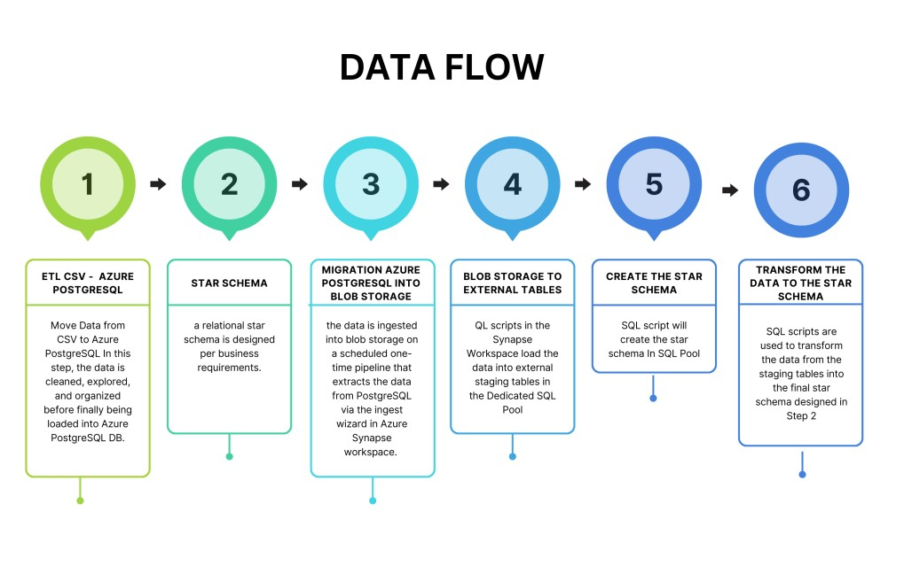

# 2023-AzureSynapse-SQLPool-ETL
 
<h1 align="center">
   
  
   
  Development Technologies 
   
</h1>

  
  
  
  
  
  

 
  

  <a href="#Purpose">Purpose</a> •
  <a href="#how-to-use">How It Work</a> •
  <a href="#CodeFlow">Code Flow</a> •
  <a href="#Credit">Credit</a> •
  <a href="#Screen">Screen</a> •

## Purpose
The goal of this project is to develop a data warehouse solution using Azure Synapse Analytics.
Bussiness Requirements :
* Time-sensitive reports for trips
* Time-sensitive reports for payments
* Analytics per individuals and age groups
* Analytics per individual trips and payments 

> **Note**
> Resources related to each step are divided into their respective folders.

## CodeFlow

Step 0: Set up Azure Resources
In this step, the necessary Azure resources for the project, including an Azure PostgreSQL database, an Azure Synapse workspace, and a Dedicated SQL Pool and database within the workspace, are created. Screenshots of each allocated resource are provided in the specific folder.

Step 1: Move Data from CSV to Azure PostgreSQL  
In this step, the data is cleaned, explored, and organized before finally being loaded into Azure PostgreSQL DB.

Step 2: Design a Star Schema  
In this step, a relational star schema is designed per business requirements. Two fact tables to support analytics (Trip) and (Payments) are utilized for performance, and time-sensitive dimensional tables up to seconds  precision  are integrated to support the analysis. After designing the data, it is debugged, error-proofed, and tested in Azure PostgreSQL before migration.

Step 3: Migrate from Azure PostgreSQL into Blob Storage  
In this step, the data is ingested into blob storage on a scheduled one-time pipeline that extracts the data from PostgreSQL via the ingest wizard in Azure Synapse workspace. Screenshots are provided.

Step 4: Extract the Data from Blob Storage and Move to External Staging Tables in the Data Warehouse  
In this step, SQL scripts in the Synapse Workspace load the data into external staging tables in the Dedicated SQL Pool.

Step 5: Create the Star Schema  
SQL script will create the star schema.

Step 6: Transform the Data to the Star Schema  
SQL scripts are used to transform the data from the staging tables into the final star schema designed in Step 2.

## How It Work
Follow each step and requirments.txt 

## Credit
Matt Swaffer : (https://www.linkedin.com/in/maswaffer/)
 
Udacity : (https://www.udacity.com/course/data-engineering-with-microsoft-azure-nanodegree--nd0277)

This software uses the following open source packages:

See requirements.txt

---

> Website(https://) -
> GitHub (https://github.com/Marshi00) - 
> Linkedin (https:)

